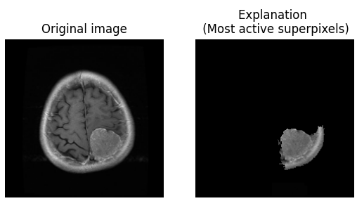

Implementation of LIME (Local Interpretable Model-Agnostic Explanations) for image data based on
- https://arxiv.org/abs/2102.06307
- https://arxiv.org/abs/1602.04938 

Example

Images: https://www.kaggle.com/datasets/masoudnickparvar/brain-tumor-mri-dataset
